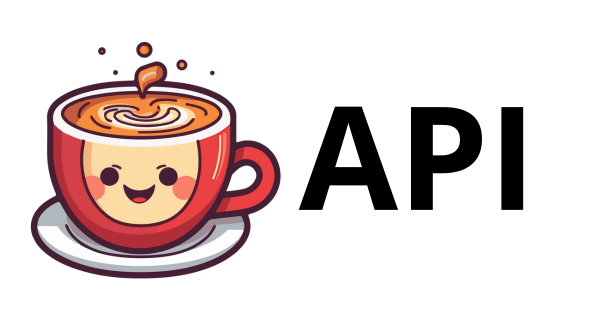

# ☕ Cafe Api ☕

This is an API to get coffees with emojis, it is a small project but it teaches the basics of APIs. 

## Clone the Repository
`git clone https://github.com/neo091/cafe-api.git`

## Install Dependencies
`npm install`

## Run project
`npm run dev`

## Errors
### MongooseError
`MongooseError: The uri parameter to openUri() must be a string, got "undefined". Make sure the first parameter to mongoose.connect() or mongoose.createConnection() is a string.`

This happens because you do not yet have the [MongoDB](https://www.mongodb.com/) URL configured for your database.
### Solution "MongooseError"
- change the env file name to .env
- Change the value of ATLAS_URI to the URL you get when creating your Cluster in Mongo DB
- save changes and run you project!